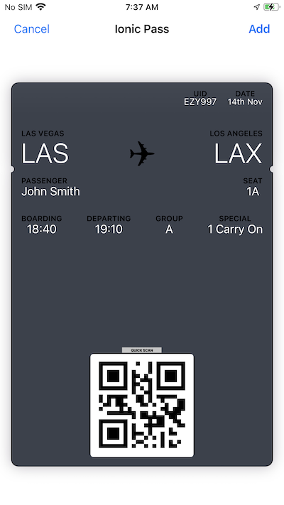

# Sample App
This sample Capacitor application will download and add a pass to Apple Wallet.

## Build and Run
Run at the command line:
- `npm install`
- `npx ionic build`
- `npx cap sync`
- `npx cap run ios` (to run the app with iOS)

## Downloading a pkpass file
You can download a pkpass file (eg in a Capacitor app) using the standard Javascript fetch api:
```typescript
  public async get(url: string): Promise<string> {
    const response = await fetch(url);
    const blob = await response.blob();
    const base64 = await blobToBase64(blob);
    if (!base64 || base64 instanceof ArrayBuffer) {
      throw new Error(`Unable to get ${url}`);
    }
    return base64;
  }
```

As we need the pkpass data base64 encoded we have a helper function called `blobToBase64`:
```typescript
function blobToBase64(blob: Blob): Promise<string | ArrayBuffer | null> {
  return new Promise((resolve, reject) => {
    const reader = new FileReader();
    reader.onerror = reject;
    reader.onload = () => {
      resolve(reader.result);
    };
    reader.readAsDataURL(blob);
  });
}
```

## Adding to Apple Wallet

You can add your pkpass data to the mobile device using a plugin called `capacitor-pass-to-wallet` which you can install with:

```bash
npm install capacitor-pass-to-wallet
npx cap sync
```

Call the `addToWallet` function passing in the base64 pkpass data you downloaded:

```typescript
import { CapacitorPassToWallet } from 'capacitor-pass-to-wallet';
...
await CapacitorPassToWallet.addToWallet({ base64: data });
```

You should see a standard Apple "add pass" dialog with details of your pass (example below). The user can click "Add" to add to Apple Wallet.

